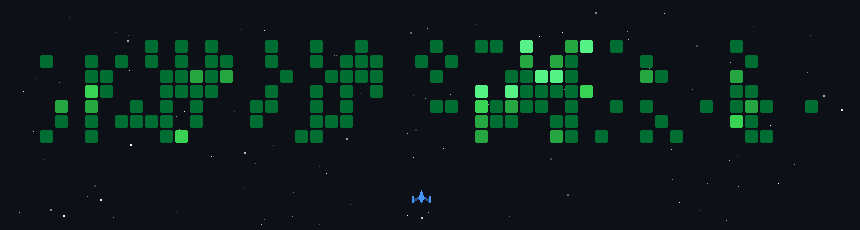

# hey, I'm Durga Prasad
### `I Adapt And Win Anyway`

**🏆 4th Place, Monad Blitz Bengaluru 2025 · Finalist, Smart India Hackathon 2025 · Finalist, Meta OpenEnv × Hugging Face**

---

### top builds

#### [CINERA](https://github.com/Durgaprasad-Developer/CINERA) — AI Film Streaming Platform
Full-stack streaming platform for AI-generated cinema: JWT auth with admin-guard middleware, time-expiring signed-URL video delivery, and a Gemini-embeddings recommendation engine using Postgres RPC cosine-similarity search.

#### [DevDocs AI](https://github.com/Durgaprasad-Developer/Dev-Docs) — Self-Updating Developer Docs
Generates and maintains documentation straight from a live GitHub repo: AST-based code parsing, webhook-driven change detection, and a pgvector-backed RAG chat assistant for exploring the docs.

#### [Git X-Ray](https://github.com/Durgaprasad-Developer/Git-XRay) — AI-Powered GitHub Portfolio Reviewer
Keeps deterministic signal scoring separate from AI interpretation — a weighted scoring engine computes the actual score across 6 dimensions, Gemini only writes the natural-language review, so it can't hallucinate a rating.

#### [HeyGen-Clone](https://github.com/Durgaprasad-Developer/Heygen-clone) — Talking-Avatar Pipeline *(experimental, in progress)*
FastAPI ingestion gateway, async audio/video worker queues, and a from-scratch PyTorch RL (GRPO) loop for lip-sync alignment.

**more builds →** [Krow](https://github.com/Durgaprasad-Developer/Freelance-Escrow) · [Cognitive RAG](https://github.com/Durgaprasad-Developer/Cognitive-RAG) · [UX-Ray](https://github.com/Durgaprasad-Developer/UX-Ray) · [Sortiq](https://github.com/Durgaprasad-Developer/Sortiq)

---

### 🎨 stack
`JavaScript` `TypeScript` `Java` `SQL` `Node.js` `Express.js` `FastAPI` `MongoDB` `PostgreSQL / pgvector` `Supabase` `Prisma ORM` `Docker` `GitHub Actions`

---

[YouTube](https://www.youtube.com/@durgaprasadBuilds) · [LinkedIn](https://www.linkedin.com/in/durga-prasad-reddy-a151382a0/) · [durgaprasadpersonal@gmail.com](mailto:durgaprasadpersonal@gmail.com)
